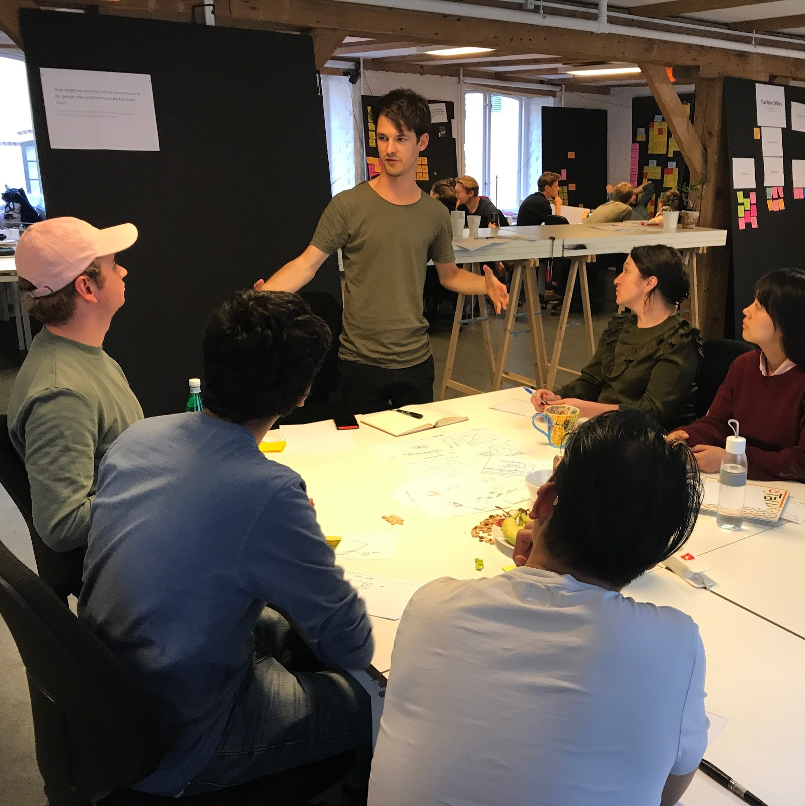
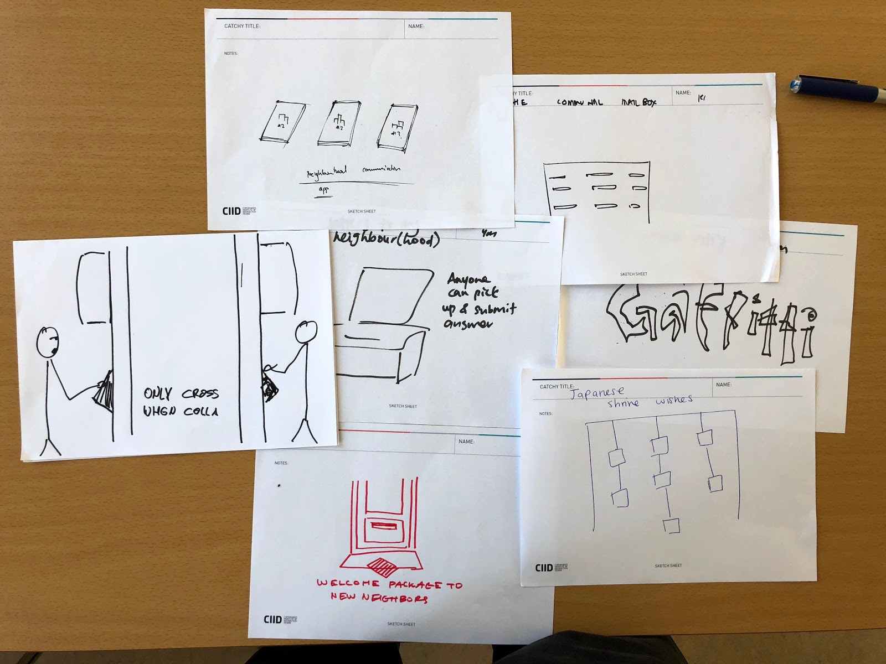
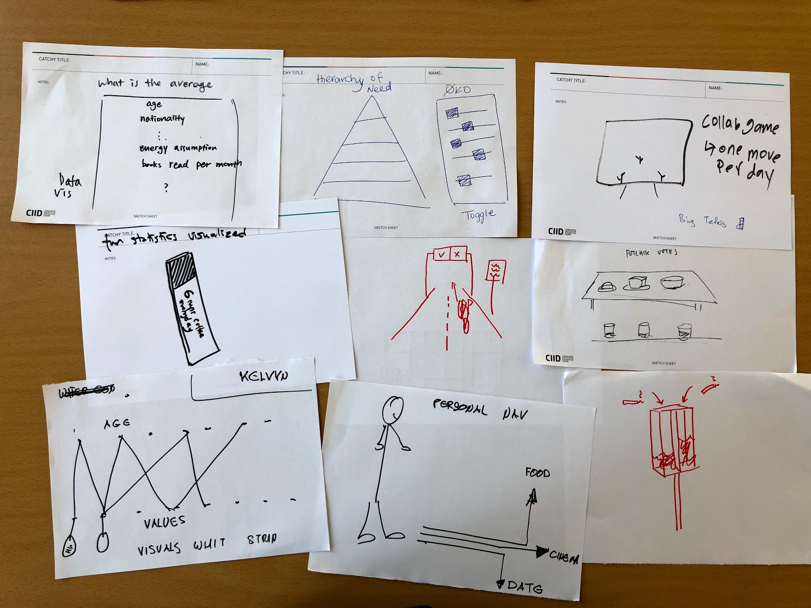
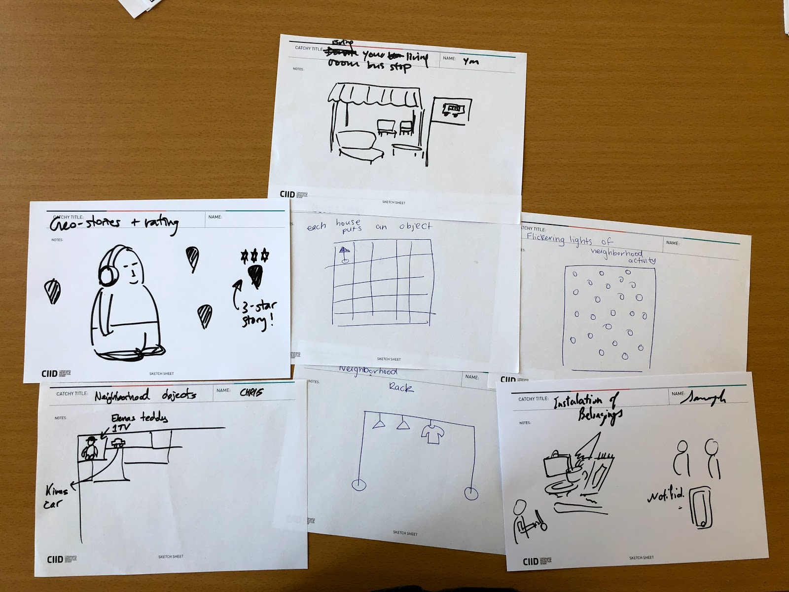

>66% of All Humans Will Live in Cities by 2050
><footer><cite>—UN, 2014</cite></footer>

## Collective Brainstorm

The third week we had collective brainstorms so I started to think about HMWs for the session I had the following day. It felt too early to have an ideation session, but I guess at one point it has to start.
In addition I had an very interesting talk with Annelie about her New Europe Project and got a lot of inspiration and discussion always helps to make things a bit more concrete.
To come up with a lot of HMWs I wrote a quick HMW generator Website to come up with some crazy HMWs, which was fun it generated a lot of crazy HMWs.

The HMWs I where:
* How might we build a collective identity of a neighborhood in an engaging way?
* How might we design for calm moments in the city using play? — did not work so well.
* How might we design for engaging small democratic negotiations in a community centre?
* How might we promote social interactions in for people who only live in a city for some days? — I did not communicate it properly to the whole group I have the feeling.
* How might we use asynchronous play in the urban space? – not used during the collective brainstorm.

Overall I got some inspiration but also I had the impression everyone was quite tired my ideation being the last of three hours in a row. Prompts and insights on cards would be a good idea to try out next time.

*Ideas Cluster 1, with ideas around connecting the neighborhood through a shared identity, but also just get people together*

*Ideas Cluster 2, with ideas around voting and visualisations in the urban environment*

*Ideas Cluster 3, with ideas around shared identity but also goods*

## Related Inspiring Projects

[View related inspiring projects at are.na](https://www.are.na/share/FCnqkGj)

<!--<iframe width="560" height="315" src="https://www.youtube.com/embed/rIPfpGCxONQ?rel=0&amp;controls=0&amp;showinfo=0" frameborder="0" allowfullscreen></iframe>-->
