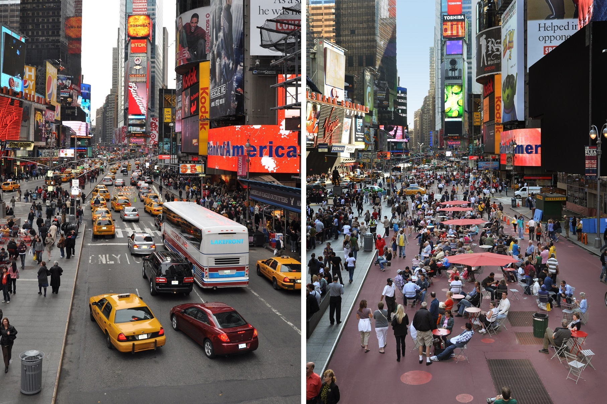

>66% of All Humans Will Live in Cities by 2050
><footer><cite>—UN, 2014</cite></footer>

Thinking of more and more people moving to cities and the demand to have a high quality of living in increasingly dense the cities.
I started of my research with the very broad statement of intent: **understand urban metal wellbeing**

I am inspired by some future cities projects and very interested in the social implication of the ways we live together in the future.

Knowing that this is a very broad statement of intent to start with I knew that I will just have to look out for promising opportunity areas which spark my interest.

## I want my Final Project to

Challenge myself in user research and iteration, I have the feeling with previous projects we usually spent a lot of time for one or the other but never both, which always felt a bit of a shortcoming. Since I enjoy building things a lot and I am a big believer in prototyping to learn but also to ideate, I definitely want to spent a good amount of my time prototyping and building.

I want to feel in control of my final project as much as possible, with spending the propper amount of time on reflecting. I know already that there will be a lot of moments of uncertainty, but I want to try to always keep the momentum going and have as little moments of feeling stuck as possible.

## My starting point

How can urban spaces and additions and modifications to the environment affects mental wellbeing?
What can be learned from rural areas? Or different city areas of Copenhagen?

To narrow my topic further down I want to form some assumptions through desk research, compare cities and come up with hypothesis which can lead my research. To get inspired and have a quick dive into the topic I plan to have some interviews with experts in combination with some observations and interviews in Copenhagen.

*Planing out my 10 weeks with post-its*

*Early thoughts mind map*

## This project is relevant because

Urban citizens increasingly suffer from mental health problems, which can range from mild depressions to schizophrenia, or arguably even cancer. While we don't know all factors causing mental health problems, we know that one strong social connections and social capital is one of the most effective ways to prevent mental health problems. That's why I want to explore in this project different ways to create pro-social interventions, which can facilitated at times but possibly also prevent interactions when not desired.

## Early Inspirations

### Times Square Place Making / Prototyping

<iframe src="https://embed.ted.com/talks/janette_sadik_khan_new_york_s_streets_not_so_mean_any_more" width="854" height="480" style="position:absolute;left:0;top:0;width:100%;height:100%" frameborder="0" scrolling="no" allowfullscreen></iframe>

### Regen Village

*http://www.regenvillages.com/*

https://www.ted.com/playlists/29/our_future_in_cities

### Transformation of cities

<iframe src="https://embed.ted.com/talks/jaime_lerner_sings_of_the_city" width="854" height="480" style="position:absolute;left:0;top:0;width:100%;height:100%" frameborder="0" scrolling="no" allowfullscreen></iframe>

>Cities are not a problem, they are a solution, to climate change …
><footer><cite>Jaime Lerner, 2007</cite></footer>

### Lauren Mccarthy, Tools for Improved Social Interacting
<iframe src="https://player.vimeo.com/video/8549273" width="640" height="360" frameborder="0" webkitallowfullscreen mozallowfullscreen allowfullscreen></iframe>

<!---
In understanding urban mental well-being of (adults/teenagers).
How can urban spaces and additions and modifications to the environment affects mental health?
What can be learned from rural areas? Or different city areas of Copenhagen?

One comprehensive source of information around the topic I found at:
http://www.urbandesignmentalhealth.com/facts-and-figures.html
http://lauren-mccarthy.com/Social-Turkers
http://lauren-mccarthy.com/Relatable
http://lauren-mccarthy.com/Tools-for-Improved-Social-Interacting
-->
