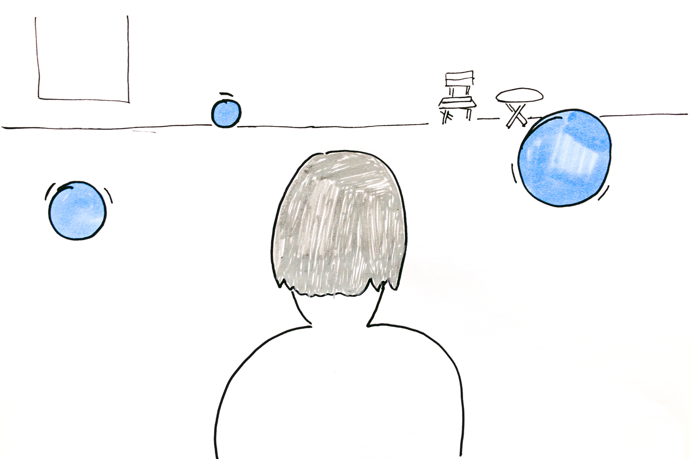

## Experiment I

### Insights

**The perception of Nørrebro changed a lot after the shooting.**

>The shooting the last months changed the place a lot, the police is now constantly at the places and people are of course aware of it.
><footer><cite>Gustav, 2017</cite></footer>

**There are a lot of different attempts to create harmony in the diverse population of Nørrebro.**

>After the shooting everyone came here to backup and say that this is a good place. that took my heart. People in the community certainly got closer together. We protest silently against the violence happening with cake and donuts.
><footer><cite>Marie, 2017</cite></footer>

>There is a hidden city behind the facades of Porto — talking about the islands (ihlas) in the courtyards of Porto, where the poor working class was and is living.
><footer><cite>João, 2017</cite></footer>

### Idea

This prototype is an exhibition in the urban space, where *visitors* of the exhibition could experience the rich diverse events, but also just daily activities of other people living in the same neighbourhood. The idea is inspired by the recent events happening in Nørrebro as response to the shooting, where people show their support for the neighbourhood and more communal activities are happening now than before. One of the efforts made is also to fight the perception that the area is a dangerous place. Particular Nørrebro has a very diverse population and activities happening, so it will be particular interesting for citizens living there but also visitors to have a glimpse into other peoples activities.

*The idea is that there will be spheres added to the space by AR, when people walk closer they can have a audio peak into them. When they walk into the sphere it will they can see a 360° video of a activity or event happening at the same place*

### Prototyping Questions

* How is to experience AR through the phone, for a longer time?
* Is 360° video a valid way to deliver intimate experiences?
* Can I build a AR prototype in a decent time?

### Prototyping

The experiment was conducted using as smartphone with a Unity app developed for the prototype using AR Kit.
In addition some 360° videos where taken, as well as audio samples to complete the experience.

<iframe width="640" height="360" src="https://www.youtube-nocookie.com/embed/CbvfgtmwLU8?rel=0&amp;controls=0&amp;showinfo=0" frameborder="0" allowfullscreen></iframe>

*First experiments with local audio in Unity*

### Test

Due to a personally set time constraint for the first prototype, I tested the first iteration in the very close neighborhood of the school to get a quick first impressions on the prototype.

### Learnings

* Key experiences are approaching and stepping into the sphere
* There is a bit of discomfort looking at the screen
* 360° video on a phone does not feel very intimate if you are not very close due to the broad field of view.
* Prototyping AR applications with current frameworks is quite fast.

>In general there is a bit of discomfort, walking around and just looking at the screen
><footer><cite>Matt</cite></footer>

>The sound sphere was really cool it was seamless, also because the screen got completely blue.
>Where as with the other ones the 360° Videos where too similar with the scene I was currently in.
><footer><cite>Matt</cite></footer>

>I think it would be really interesting if you could step into something more intimate, like stepping into a conversation. Also maybe the spheres could expose a bit more about what is happening inside, particular when getting closer I wanted to have this transition moment. It could be a blurry view inside the sphere.
><footer><cite>Matt</cite></footer>
