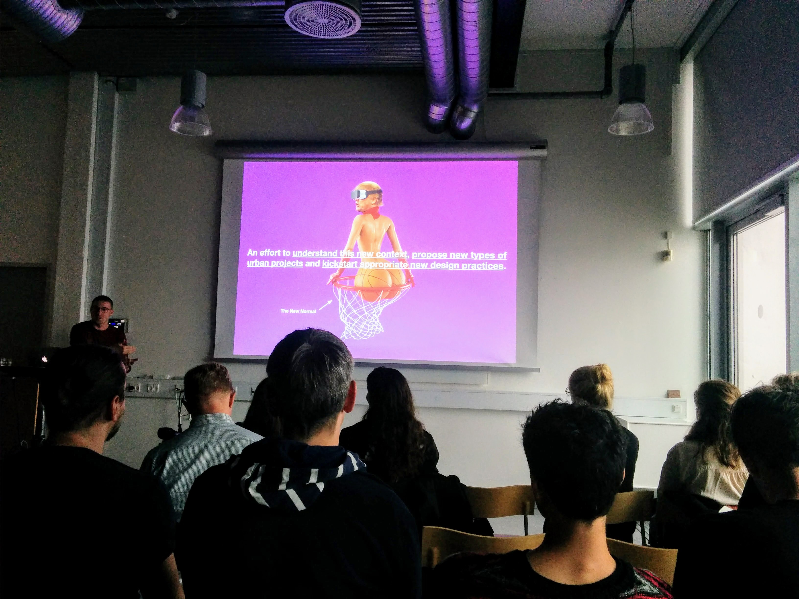
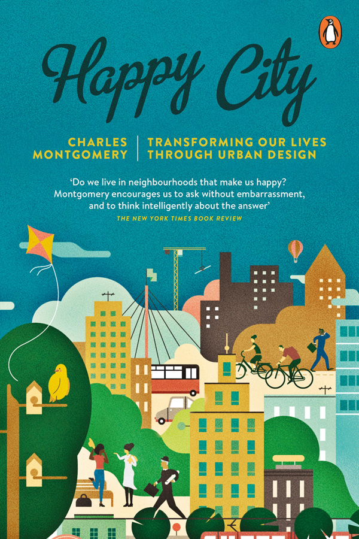
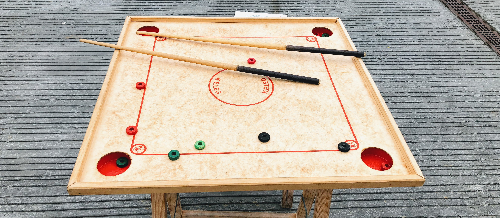
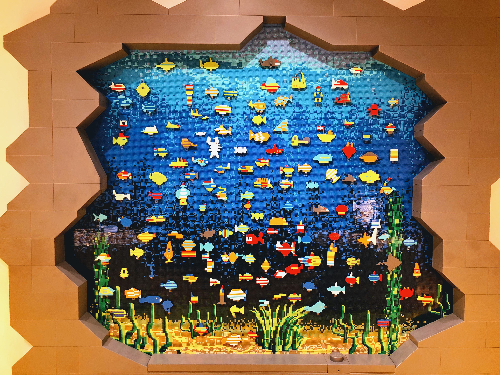
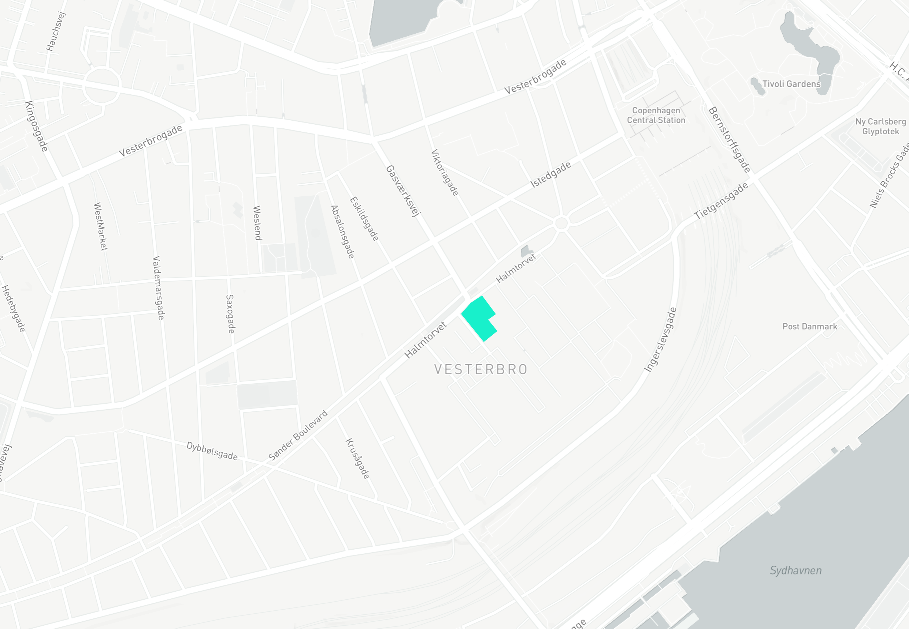
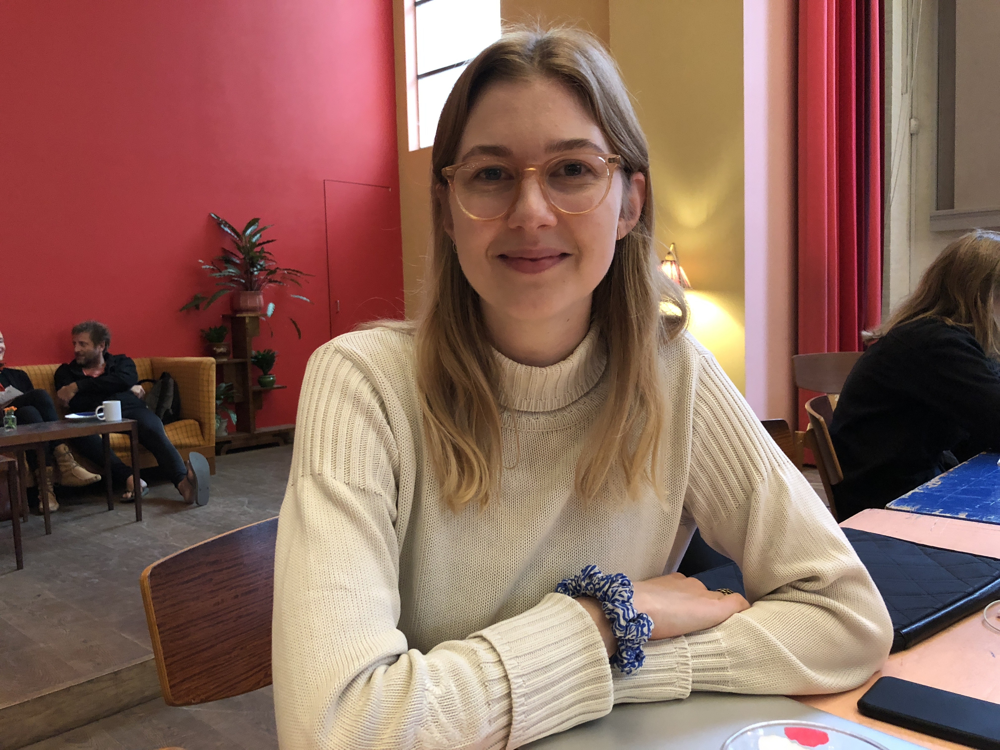
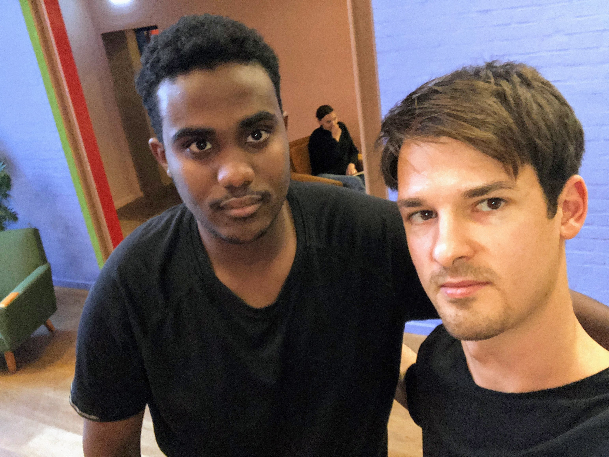
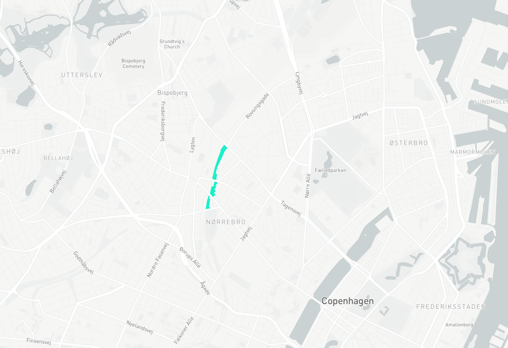
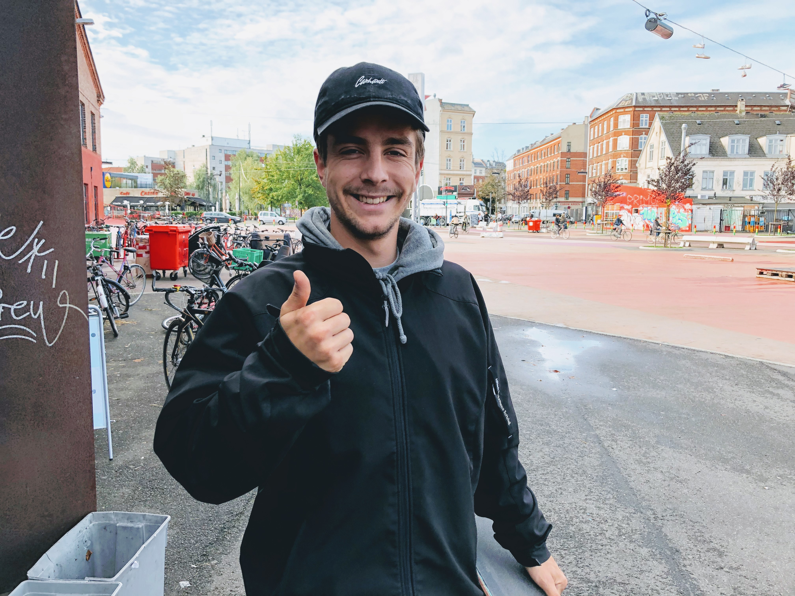
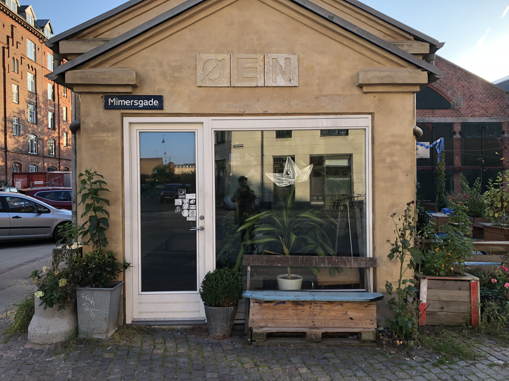

I started of my final project with the topic urban wellbeing / health knowing that I would have to narrow it down pretty quickly. During the first two weeks I jumped quickly between convergent and divergent phases in order to test out different assumptions through user or desk research. I might jumped onto things too quickly sometimes, but also I was afraid that I should be already more concrete by now.

Those two first weeks I tried to wrap my head around a more concrete topic, which I am excited about and which I could executed with the means and time given. Furthermore I arranged several more interviews which I could not conduct, because I could not find a date and time which would have worked for both sides. Particular the second week was packed with events from school.

## First Expert Interviews

>The biggest challenges I have to deal with as city planner is segregation and property speculation.
><footer><cite>Torkil, 2017</cite></footer>

*Torkil how is working as a city planner, involved in citizen participation for the city of Copenhagen*

>City design is citizens vs citizens, it's a democratic learning process.
><footer><cite>Torkil, 2017</cite></footer>

>Don't hold a meeting, hold a party.
><footer><cite>Torkil, 2017</cite></footer>

*In addition to the interview I also attended an urban planing lecture where Torkil was showing us some concrete examples of neighborhood renewal and climate change resilience projects in the city*

>Teenagers in Vienna often switch places where they hangout every few weeks, if they are mobile.
><footer><cite>Jekaterina, 2017</cite></footer>

*Jekaterina a pedagogue working in a youth centre in Vienna and I talked with her about ownership and mental health of young people in the urban space.*

>Teenagers occupy parks because there is something exciting (people, girls, police trouble) going on there.
><footer><cite>Jekaterina, 2017</cite></footer>

*Anja is a Lead Insight Expert / Cultural Anthropologist at Future Cities Catapult which shared a lot of her insights and techniques for doing research in the city with me.*

>Using extreme or non users for product research is a good way to identify completely new use cases.
><footer><cite>Anja, 2017</cite></footer>

Going forward with my user research knew I will have to pick a more concrete spot in Copenhagen and either research more around how people cope with factors which are influencing their mental wellbeing or pick one aspect which is influencing mental wellbeing like social networks in the urban neighborhood, stress, loneliness, segregation …

## Additional Research and Inspiration

*Nicolay Boyadjiev's lecture talking about the projects at [Strelka](http://strelka.com) during the Techfestival reminded and inspired me that I might have to take a bit of a different approach in integrating user research in my work if I want to design something more innovative.*

>People are very emotional when they are not involved in changes in their sourounding
><footer><cite>Karin Brandt, coUrbanize, 2016</cite></footer>

*During our industry project in Porto I had a inspiring talk with a Portuguese architect.*

>There is a hidden city behind the facades of Porto — talking about the islands (ihlas) in the courtyards of Porto, where the poor working class was and is living.
><footer><cite>João, 2017</cite></footer>

*When walking through Porto the courtyard in between all this small houses — often only 2 by 2 meter — the street felt very much like a extension of the living room. This is one example but in Portugal I had the feeling that everything is a bit more open to the street and more is happening at the street. This probably influences neighborhoods in Porto and the people living there a lot.*

>The most powerful ingredients in human happiness are strong, positive social connections.
><footer><cite>Charles Montgomery, Happy City, 2014</cite></footer>

<iframe width="560" height="315" src="https://www.youtube.com/embed/S7dDtJ8zyEU?rel=0&amp;controls=0&amp;showinfo=0" frameborder="0" allowfullscreen></iframe>

<!--  -->

<!-- Add more here resources links … -->

*At the harbour next to that Kvæsthusselskabet there is regularly a ship with games arriving. Its mostly popular with kids but also other people stop there and start a game.*

[More tactile games from the game ship](https://photos.app.goo.gl/hLCmj2sTtDfuV32t2)

*The visit I didi to the lego house was in particular interesting when it comes to collaboration and play. The fish wall shows different fishes which are designed by the visitors, which stay there on the wall in addition they are floating in a digital fish tank as well.*

<iframe width="640" height="360" src="https://www.youtube-nocookie.com/embed/v7_q9JaYNkY?rel=0&amp;controls=0&amp;showinfo=0" frameborder="0" gesture="media" allowfullscreen></iframe>

*The stop and motion studio at the Lego House was particular inspiring when it comes to possibly asynchronous engagement.*

[More pictures from the Lego House](https://photos.app.goo.gl/lQh9qT22ceGeOaTG2)

### Online Research

[Online research link collection at are.na](https://www.are.na/share/XDZlqie)

## Field Research

Through my early research and interviews I identified two potential opportunity areas, in which I was more interested and seemed promising: **Segregation in the urban neighborhoods** and  **Co-creation of the urban space**

To have a better understanding of those areas and encounter new insights I picked to locations to investigate further and talk to people there about their neighborhood and how it is to live there.

### Absalon

[Absalon](https://absaloncph.dk/) is your living room away from home. Your breakfast café, your afternoon hangout, your evening bar and the place you eat your dinner with 180 other people, which opened two years ago.

*At Absalon various different activities take places every day like yoga, table tennis and workshops.*

*At Absalon I had a long talk with Abdil who moved from London to Copenhagen Vesterbro two years ago and is now becoming a blacksmith.*

*Sara studied sociology and works now at Absalon since one year and is one the founder of the Copenhagen branch of the Linked City Festival and NGO.*

>Our intention with Abaslon was to respect the places — former church — but change it to something completely new.
><footer><cite>Sara, 2017</cite></footer>

>Our vision is to bring people together. We are thinking a lot about how we can, through very small interventions, get people to interact with each other.
><footer><cite>Sara, 2017</cite></footer>

>At the communal dinner we introduce neighbors and people get seated. Also people have to share food at the communal dinner.
><footer><cite>Sara, 2017</cite></footer>

>I have started with the AHA track in organizing events on skill learning and connecting people.
><footer><cite>Sara, 2017</cite></footer>

>At City Link we try to create more democratic cities through art and culture.
><footer><cite>Sara, 2017</cite></footer>

>We have been trying to activate the street outside of Absalon the space outside is not really used and unwelcoming.
><footer><cite>Sara, 2017</cite></footer>

>After the shooting in Nørrebro people got closer together in the community.
><footer><cite>Sara, 2017</cite></footer>

*At Absalon I had a long talk with Abdil who moved from London to Copenhagen Vesterbro two years ago and is now becoming a blacksmith.*

>Danes raised here usually stay with their group of people.
><footer><cite>Abdil, 2017</cite></footer>

>Its hard to make friends here people don't take the time or they are stressed.
><footer><cite>Abdil, 2017</cite></footer>

>A friend of my sister moved away after studying in Copenhagen 5 years because he did not make any meaningful connections or friends here during that time.
><footer><cite>Abdil, 2017</cite></footer>

>I have no idea who is living in the same house as I am so I might recognize, even though I life here for two years.
><footer><cite>Abdil, 2017</cite></footer>

### Nørrebro Superkilen

*The long stretch of different places has a lot of different facades to it.*

*Suoerkilen is a public place with playground, sports facilities, skatepark and gastronomy, but also it is one of the main bike lanes through Nørrebro.*

*Gustav is one of the several people I talked to at Superkilen, he is at the places nearly every day since years in particular to skate but also just hangout with friends.*

>5 years ago the Superkilen was a very dark space.
><footer><cite>Gustav, 2017</cite></footer>

>people in the inner city are annoyed by skateboarders in the inner city, I am annoyed by people walking around and just looking at their phone, if they stand still that's not a problem for me. Thats one reason why I spent a lot of time here, here I have my friends and people are not annoyed by skaters.
><footer><cite>Gustav, 2017</cite></footer>

>The shooting the last months changed the place a lot, the police is now constantly at the places and people are of course aware of it.
><footer><cite>Gustav, 2017</cite></footer>

*Øen is a places I contacted at Superkilen to think about a collaborate and for a interview.*

>The shooting the last months changed the place a lot, the police is now constantly at the places and people are of course aware of it.
><footer><cite>Gustav, 2017</cite></footer>

**Maire** is in her mid 40ies, lived in Nørrebro all her live and is very engaged in the community. Se also has two grownups which already moved out and live now in the suburbs.

>The last 20 years cultural events evolved a lot. They do a lot to keep everyone together. Also there is now flea markets, shared dinners I like those a lot.
><footer><cite>Marie, 2017</cite></footer>

>Nørrebro became a center for tolerance. People here are very open minded, it's easy to get connected for people who move here.
><footer><cite>Marie, 2017</cite></footer>

>At night I stay at home now after the shootings happened. I would love to feel as save as before again, but I don't look at people differently now, when I see someone at the street.
><footer><cite>Marie, 2017</cite></footer>

>After the shooting everyone came here to backup and say that this is a good place. that took my heart. People in the community certainly got closer together. We protest silently against the violence happening with cake and donuts.
><footer><cite>Marie, 2017</cite></footer>

>Nørrebro was a dark place when I was a kid.
><footer><cite>Marie, 2017</cite></footer>

>A lot of refugees live in this area.
><footer><cite>Beatrice, 2017</cite></footer>

>I just moved here from Fredriksberg its definitely more mondain in Nørrebro.
><footer><cite>Beatrice, 2017</cite></footer>
