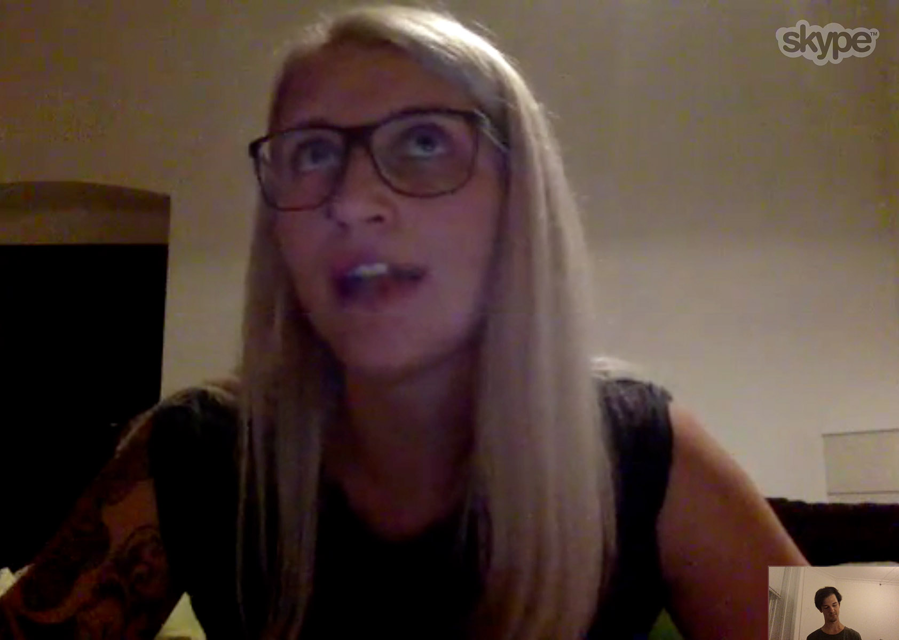

I started of my final project with the topic urban wellbeing / health knowing that I would have to narrow it down pretty quickly. During the first two weeks I jumped quickly between convergent and divergent phases in order to test out different assumptions through user or desk research. I might jumped onto things too quickly sometimes, but also I was afraid that I should be already more concrete by now.

Those two first weeks I tried to wrap my head around a more concrete topic, which I am excited about and which I could executed with the means and time given. Furthermore I arranged several more interviews which I could not conduct, because I could not find a date and time which would have worked for both sides. Particular the second week was packed with events from school.

## First Expert Interviews

*Torkil how is working as a city planner, involved in citizen participation for the city of Copenhagen*

*In addition to the interview I also attended an urban planing lecture where Torkil was showing us some concrete examples of neighborhood renewal and climate change resilience projects in the city*

*Jekaterina a pedagogue working in a youth centre in Vienna and I talked with her about ownership and mental health of young people in the urban space.*

*Anja is a Lead Insight Expert / Cultural Anthropologist at Future Cities Catapult which shared a lot of her insights and techniques for doing research in the city with me.*

In addition to a extensive desk research and several discussions among

I conducted 3 in depth interviews with a social worker, a renewal projects citizen relations manager, an urban research specialist, attended a urban planning lecture as well as the open lecture of Nicolay Boyadjiev and went to a ai meetup at the tech festival.

Going forward I knew I will have to pick a more concrete spot in Copenhagen and either research more around how people cope with factors which are influencing their mental wellbeing or pick one aspect which is influencing mental wellbeing like social networks in the urban neighborhood, stress, loneliness, segregation …

## Desk Research

>66% of All Humans Will Live in Cities by 2050
><footer><cite>—UN, 2014</cite></footer>
